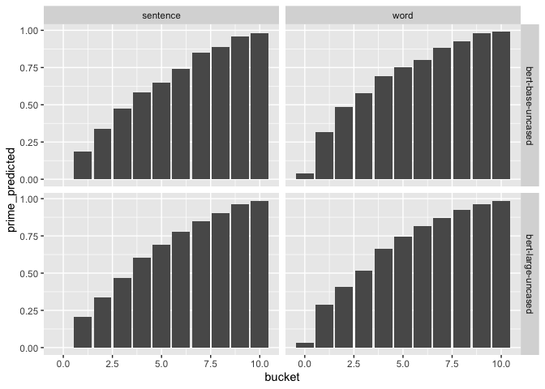

Exploring Priming in BERT
================
Kanishka Misra

## Loading data

``` r
constraint_scores <- dir_ls("../data/", regexp = "constraints_") %>%
  map_df(read_csv, .id = "model") %>%
  mutate(
    model = str_extract(model, "(?<=constraints_)(.*)(?=\\.csv)")
  ) %>%
  group_by(target, related, unrelated, relation, context) %>%
  summarize(
    constraint = mean(constraint),
    entropy = mean(entropy)
  ) %>%
  mutate(
    # Neutral sentences are synthetic, and receive a constraint score of 0.
    constraint = case_when(
      str_detect(context, "the last word of this sentence") ~ 0.0,
      TRUE ~ constraint
    )
  )

priming_results <- dir_ls("../data/priming_results/", glob = "*.csv") %>%
  map_df(read_csv, .id = "model") %>%
  mutate(
    model = str_extract(model, "(?<=results\\/priming_)(.*)(?=\\.csv)")
  ) %>%
  separate(model, into = c("model", "scenario"), sep = "_") %>%
  inner_join(constraint_scores %>% select(-entropy)) %>%
  group_by(model, scenario, target, related, unrelated, relation) %>%
  nest() %>%
  mutate(
    bucket = list(c(1:10, 0))
  ) %>%
  unnest(c(data, bucket)) %>%
  ungroup()
```

## Facilitations

Facilitation is defined in the paper as the difference of surprisals.

``` r
raw_facilitations <- priming_results %>%
  mutate(
    facilitation = log2(related_probability/unrelated_probability)
  ) %>%
  select(model, scenario, bucket, relation, constraint, facilitation)
```

## Qualitative Analysis – General Patterns

In how many cases the top predicted word was the related prime (when
primed by related)? and

``` r
priming_results %>%
  mutate(
    prime_predicted = related == related_argmax, 
    facilitation = log2(related_probability/unrelated_probability)
  ) %>%
  group_by(model, scenario, bucket) %>%
  summarize(
    prime_predicted = mean(isolated_argmax == related_argmax & related_argmax == unrelated_argmax)
  ) %>%
  ggplot(aes(bucket, prime_predicted)) +
  geom_col() +
  facet_grid(model ~ scenario)
```

    ## `summarise()` regrouping output by 'model', 'scenario' (override with `.groups` argument)

<!-- -->
